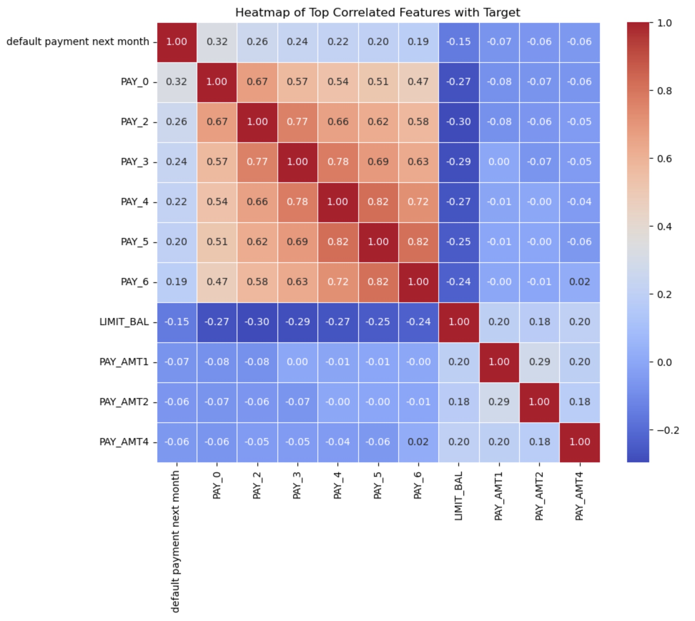
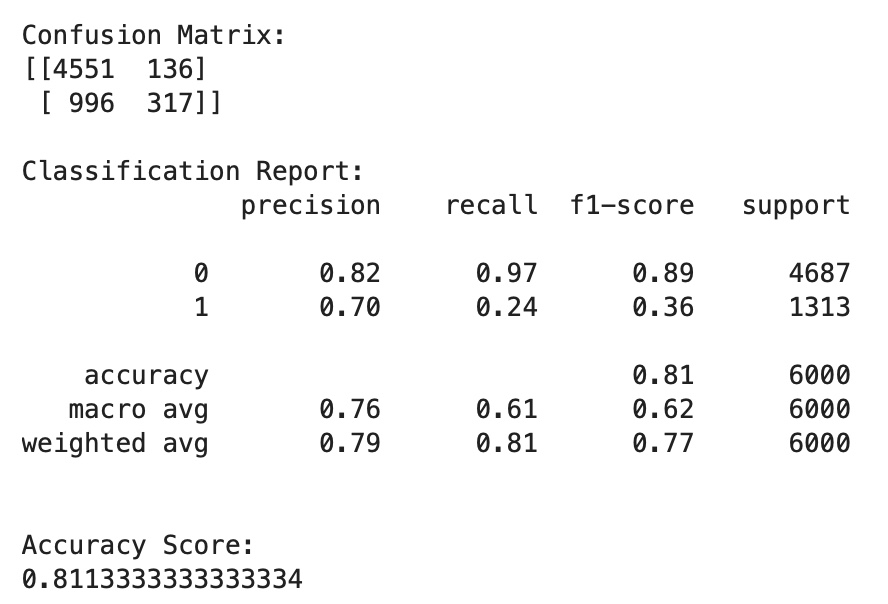
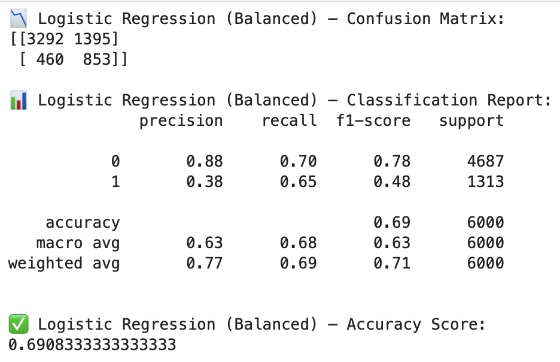
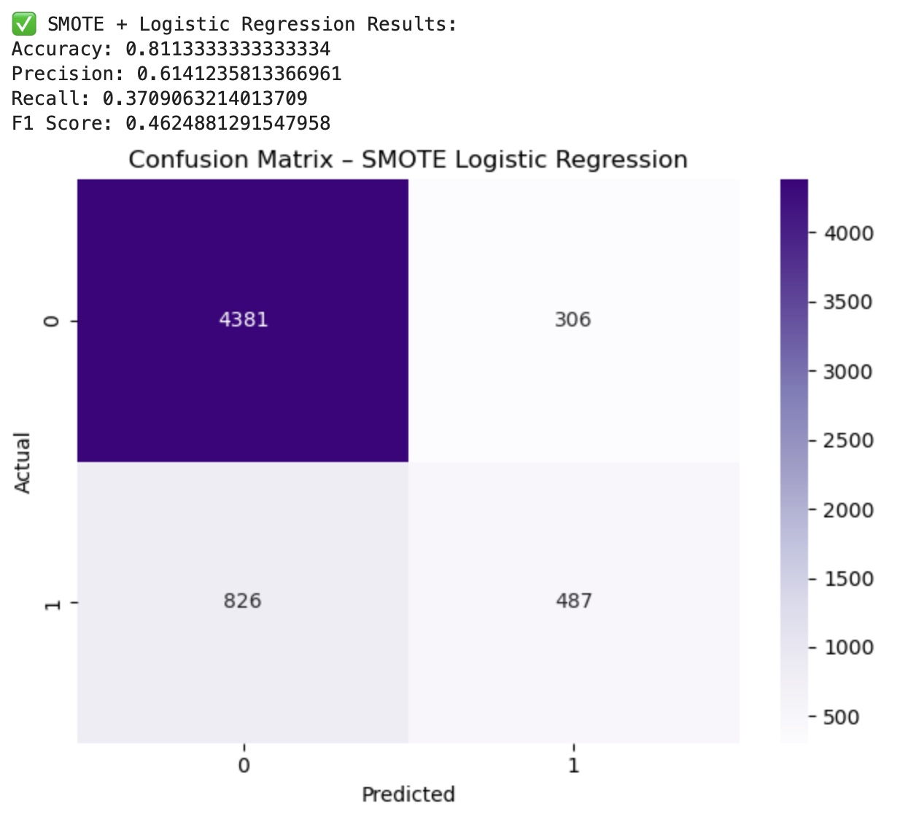
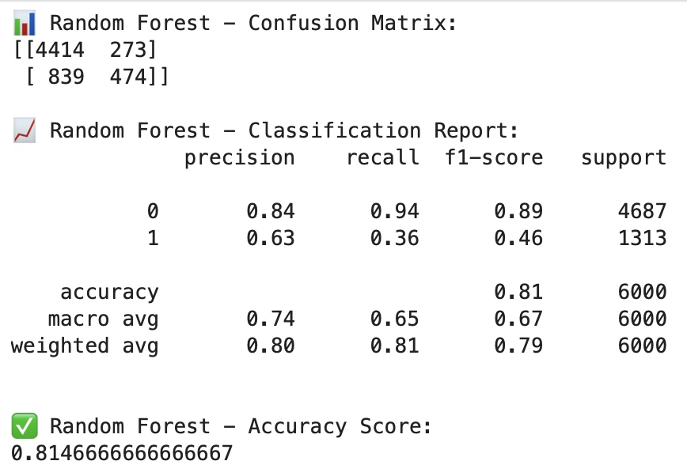

# 🧠 Credit Default Prediction – ML Classifier Project


[](https://nbviewer.org/github/hoppypilot87/ml-credit-default-prediction/blob/main/notebooks/01_data_exploration.ipynb)
[](https://github.com/hoppypilot87/ml-credit-default-prediction)
[](https://github.com/hoppypilot87/ml-credit-default-prediction)


This project explores the use of logistic regression and other models to predict
whether a credit client is likely to default. It focuses on handling class
imbalance, model evaluation, and showcasing best practices for preprocessing and
testing.

---

## 🖼️ Project Preview

📊 Heatmap of Top Correlated Features


🧮 Confusion Matrix – Logistic Regression (Vanilla)


⚖️ Confusion Matrix – Weighted Logistic Regression


🔁 Confusion Matrix – SMOTE + Logistic Regression


🌳 Confusion Matrix – Random Forest


---

## 🔍 Project Highlights

- **Dataset**: Credit default dataset from UCI / Kaggle (assumed source)
- **Goal**: Predict if a client will default using features like bill statements, payment history, and demographics
- **Models Used**:
  - Logistic Regression (Vanilla)
  - Logistic Regression with Class Weights
  - Logistic Regression + SMOTE (oversampling)
  - Random Forest (for comparison)

## ⚖️ Class Imbalance Handling

- Used `class_weight='balanced'` to address skewed target classes
- Applied **SMOTE** to oversample the minority class
- Compared metrics: **Precision**, **Recall**, **F1 Score**, **Accuracy**

## 📊 Key Results

| Model                          | Accuracy | Recall (Default) | F1 Score |
|-------------------------------|----------|------------------|----------|
| Logistic Regression (Vanilla) | ~81%     | ~24%             | Low      |
| Weighted Logistic Regression  | ~70%     | ~65%             | Better   |
| SMOTE + Logistic Regression   | ~81%     | ~37%             | Medium   |
| Random Forest                 | ~83%     | ~52%             | Strong   |

## 🚀 Extra Mile

- Visualized confusion matrices and classification reports
- Applied scaling with `StandardScaler`
- Added side-by-side model comparisons with markdown summaries

## 📁 Files

- `01_data_exploration.ipynb` — Complete notebook with code, markdown, and results
- `README.md` — Project overview

## 💡 Future Ideas

- Try XGBoost or LightGBM
- Hyperparameter tuning with `GridSearchCV`
- Export model with `joblib` for deployment

---

## 🛠️ Setup

```bash
pip install -r requirements.txt


